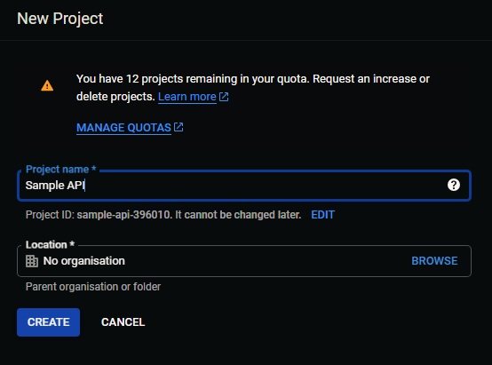

This guide will show you how to set up the Google API and Custom search engine (CSE) for usage with the google module. All of this is free if you don't exceed 100 queries a day for the CSE API.

# Setting up the Google Cloud project
In order to use any of the google APIs, you will need to set a Cloud project up.

1) Navigate to the [Google Cloud console homepage](https://console.cloud.google.com)
2) Click on `Select a project`  

3) Click on `New project`  

4) Configure it as you wish, click `Create`  

The Project is set up now, a notification will pop up saying it is creating. Wait for it to finish creating the project and hit `Select project`  

If the notification doesn't appear for whatever reason you can also click on `Select project` in the top left corner and click on your new project.  

# Enabling the relevant APIs
Now we will need to enable the two relevant APIs - CSE v1 and Youtube data v3.

1) From the project homepage, click on `APIs and services`  

2) Hit search and look up `Custom search`, go to the `Custom search API` menu  

3) Once here, you can hit `Enable`
4) You can repeat these steps for the Data API  

# Creating an API key
Both APIs used by Turingbot are now enabled, we can move on to creating an API key.

1) On the left side of your screen, click on `Credentials`  

2) Click `Create credentials` and select `API Key` from the popup menu  

3) A screen with your API key will now show up, please **copy it into a safe place** as **you won't be able to see it again**.

4) As a safety precaution, you can click on the newly created API key entry and restrict it to only use the `Custom search engine` and `Youtube Data` APIs.  

# Setting a Custom search engine up
Now that we have the relevant APIs enabled and have a valid API key prepared, we can create a custom search engine to use.

1) Go to the [Googles Programmable search engine website](https://programmablesearchengine.google.com/about/)
2) Click `Get started`, then click on `Add`
3) For use with TuringBot select the `Search the entire web` option, enable `Image search`. `SafeSearch` is optional but preferred. Once done, hit `Create`  

4) Once you hit `Create` you will get a short Javascript snippet with its implementation, you can copy the ID from the first line after `cx=` or you can hit `Customize` and copy the `Search engine ID` from there.  

You now have all the necessary credentials to use the Google module.

[//]: # (All credentials and Ids used in this guide have been invalidated.)
