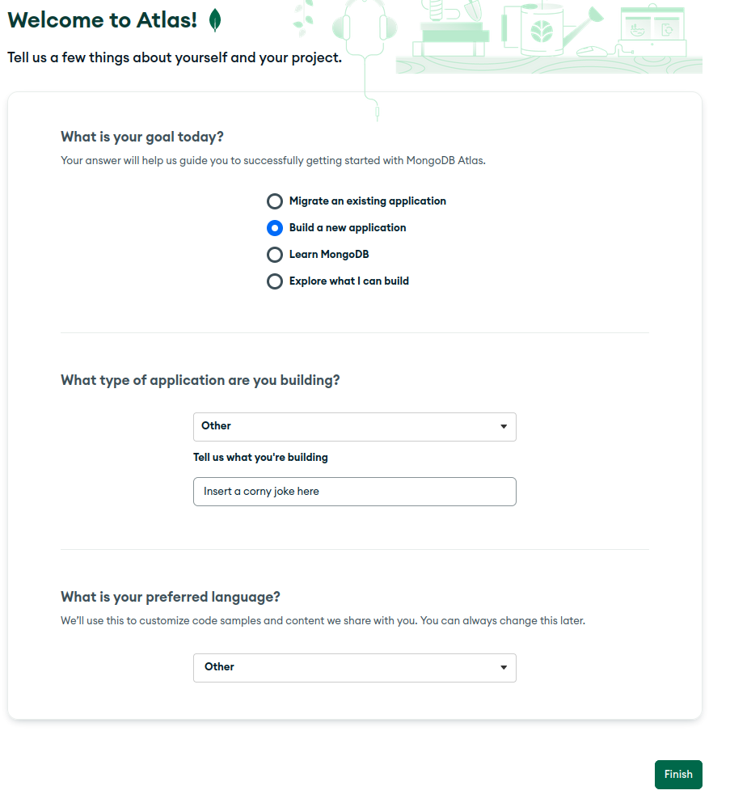
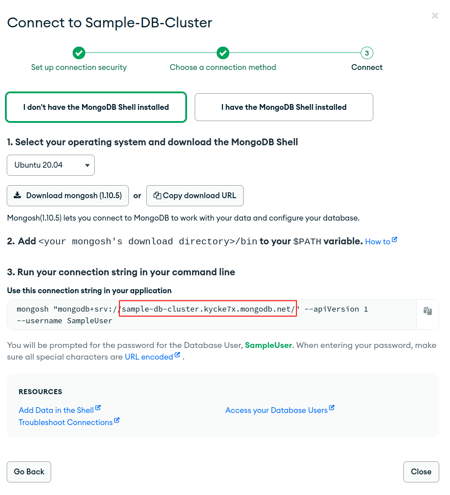

This guide will show you how to set up a [MongoDB Atlas](https://www.mongodb.com/atlas/database) database for use with TuringBot. The setup for M0 (the free tier) is free of charge.

# Creating the DB cluster

1) Head to the [signup page](https://www.mongodb.com/cloud/atlas/register) and fill your details in, agree to the terms and click `Create your Atlas account`

2) Once logged in, you will get a welcome screen prompting you to deploy the database cluster. Fill it in as you wish and click `Finish` <br>



3) You will now be prompted with some more advanced DB info. Make sure to set the server to M0 if you want the Free tier. Click `Create` once you are done. <br>


4) You will now be faced with the login setup. Create an user that you will log in with, mark the username and password down. <br>


5) Add your IP address (if it hasn't been added already), if you have a dynamic ip add your whole subnet. Once done, click on `Finish and close`


The cluster is now created and ready for use with Turingbot.

# Connecting to the DB Cluster

1) Click on `Connect` <br>


2) Click on `Shell`, the third step now contains all necessary information to proceed. Copy the value in the quotation marks exclkuding the protocol (`mongodb+src://`)



3) We are now done with the webpage setup, you can now open the bot config up and fill the info in accordingly:

```jsonc
 "mongodb": {
    "protocol": "mongodb+srv://",
    "address": "<the value you just copied (WITH THE TRAILING /)>",
    "username": "<username>",
    "password": "<password>"
  },
```

You can now start the bot and use MongoDB normally.


[//]: # (All credentials used in this guide have been invalidated before pushing.)
